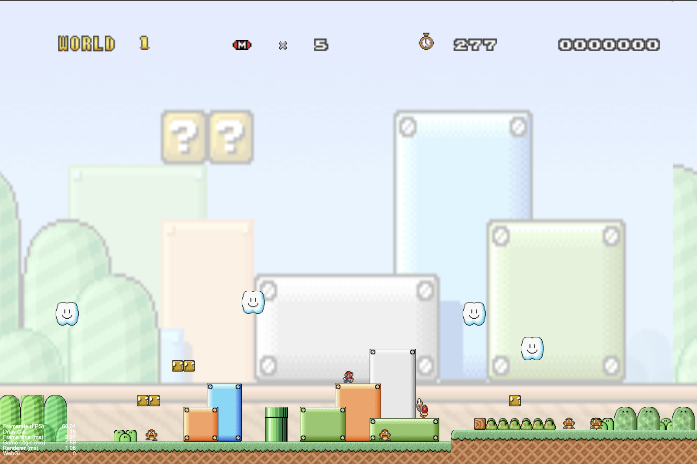
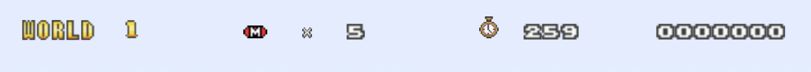

# Software Studio 2024 Spring Assignment 2

## Student ID : 111062117 Name : 黃祥陞

### Scoring

|**Basic Component**|**Score**|**Check**|
|:-:|:-:|:-:|
|Complete Game Process|5%|Y|
|Basic Rules|55%|Y|
|Animations|10%|Y|
|Sound Effects|10%|Y|
|UI|10%|Y|

|**Advanced Component**|**Score**|**Check**|
|:-:|:-:|:-:|
|firebase deploy|5%|Y|
|Leaderboard|5%|N|
|Offline multi-player game|5%|N|
|Online multi-player game|10%|N|
|Others [name of functions]|1-10%|N|

---

## Basic Components Description : 
### World map
- 在 Menu 有兩個關卡可以選（但兩個關卡都是一樣的）

### Player
- Mario 會因重力下墜，角色、地板、敵人之間的碰撞機制正常
- 使用 WASD 來控制
- 按下 space 會跳到終點前面，方便快速 demo
- Small Mario 吃到蘑菇後會變 Big Mario

### Enemies
#### Goomba
- 被踩到後會死亡，獲得 $100$ 分

#### Turtle
- 被踩到後會變成龜殼，並獲得 $100$ 分
- Mario 可以推龜殼，會往反方向快速移動，並獲得 $100$ 分
- 當龜殼快速移動時，可以清除所有碰到的 Enemies
- 當龜殼快速移動時，Mario 可以從上方踩它，使龜殼停止，並獲得 $100$ 分

#### Flower

### Question Blocks
- 分為兩種 Question Blocks
- Coin: 加 $100$ 分
- Mushroom: 讓 Small Mario 變成 Big Mario

### Animations
#### Player has walk & jump animations (5%)

#### Enemies Animation (each for 2%, up to 5%)
- Goomba 移動
- Flower 上下移動 / 花瓣開合
- Turtle 移動、龜殼快速移動

### Sound Effects
- 有 BGM
- Mario 跳起來有音效
- Mario 死掉有音效
- 生命減少有音效
- 遊戲結束有音效
- 金幣有音效
- 蘑菇出現有音效
- Small Mario 吃到蘑菇變成 Big Mario 有音效
- Big Mario 碰到敵人變成 Small Mario 有音效
- Mario 踩到敵人有音效
- Mario 踢到龜殼有音效
- Mario 通關成功有音效

### UI

## Advanced Component Description : 
### Firebase
- Firebase deploy
- Login / Sign-Up

## Firebase page link (if you deploy)
- https://mario-cdbd4.web.app