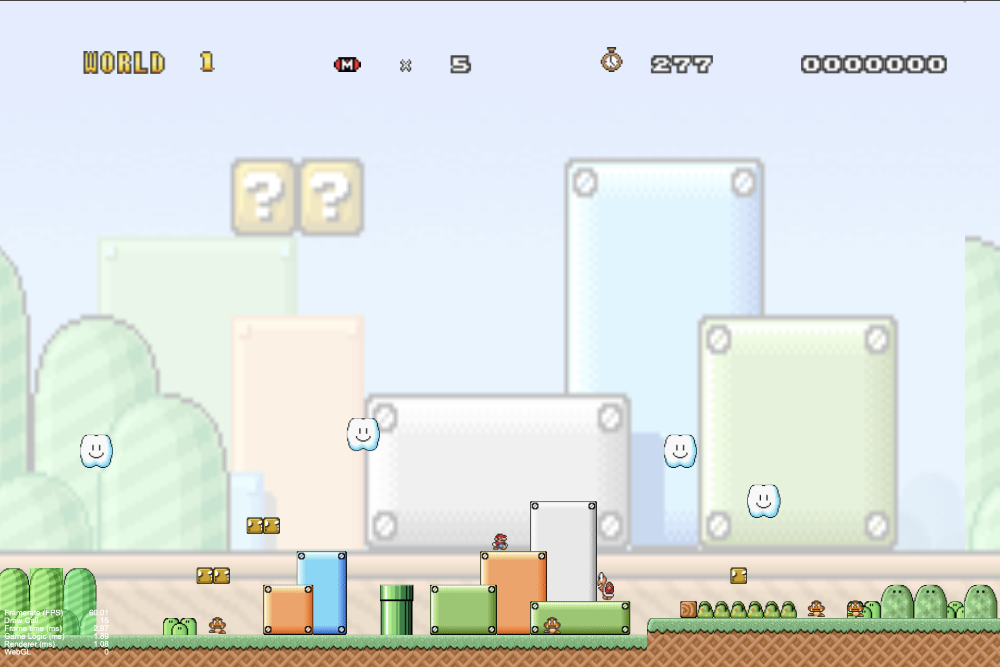
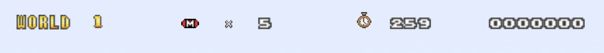

# Web Mario
This is "2024 Spring CS241002 Software Studio" course project at National Tsing Hua University (NTHU).

## Scoring

| **Basic Components**           | **Score** | **Check** |
| :----------------------------: | :-------: | :-------: |
| Complete Game Process          |    5%     |    Y      |
| Basic Rules                    |   55%     |    Y      |
| Animations                     |   10%     |    Y      |
| Sound Effects                  |   10%     |    Y      |
| UI                             |   10%     |    Y      |

| **Advanced Components**        | **Score** | **Check** |
| :----------------------------: | :-------: | :-------: |
| Firebase Deploy                |    5%     |    Y      |
| Leaderboard                    |    5%     |    N      |
| Offline Multiplayer Game       |    5%     |    N      |
| Online Multiplayer Game        |   10%     |    N      |
| Others [name of functions]     | 1-10%     |    N      |

---

## Basic Components Description

### World Map
- In the Menu, two levels are available for selection (though both are identical).

### Player
- Mario falls due to gravity. The collision mechanics between the character, floor, and enemies function correctly.
- Use WASD to control Mario.
- Press `Space` to jump to the area near the end for fast demo purposes.
- Small Mario transforms into Big Mario after collecting a mushroom.

### Enemies

#### Goomba
- Dies when stomped on, and the player earns 100 points.

#### Turtle
- Turns into a shell after being stomped, and the player earns 100 points.
- Mario can push the shell, causing it to move rapidly in the opposite direction, and the player earns 100 points.
- The moving shell clears all enemies in its path.
- Mario can stomp the moving shell to stop it, and the player earns 100 points.

#### Flower

### Question Blocks
- Two types of Question Blocks:
    - **Coin**: The player earns 100 points.
    - **Mushroom**: Transforms Small Mario into Big Mario.

### Animations

#### Player Walk & Jump Animations (5%)

#### Enemies Animations (up to 5% total)
- Goomba movement.
- Flower moving up and down / petals opening and closing.
- Turtle movement / shell rapid movement.

### Sound Effects
- Background music (BGM).
- Sound effects for Mario jumping.
- Sound effects for Mario dying.
- Sound effects for life loss.
- Sound effects for game over.
- Sound effects for collecting coins.
- Sound effects for mushrooms appearing.
- Sound effects when Small Mario touches a mushroom to become Big Mario.
- Sound effects when Big Mario touches an enemy and becomes Small Mario.
- Sound effects when Mario stomps an enemy.
- Sound effects when Mario kicks a shell.
- Sound effects when Mario successfully clears a level.

### UI

---

## Advanced Components Description

### Firebase
- Firebase deployed.
- Login / Sign-Up functionality.

---

## Firebase Page Link
- [Project URL](https://mario-cdbd4.web.app)